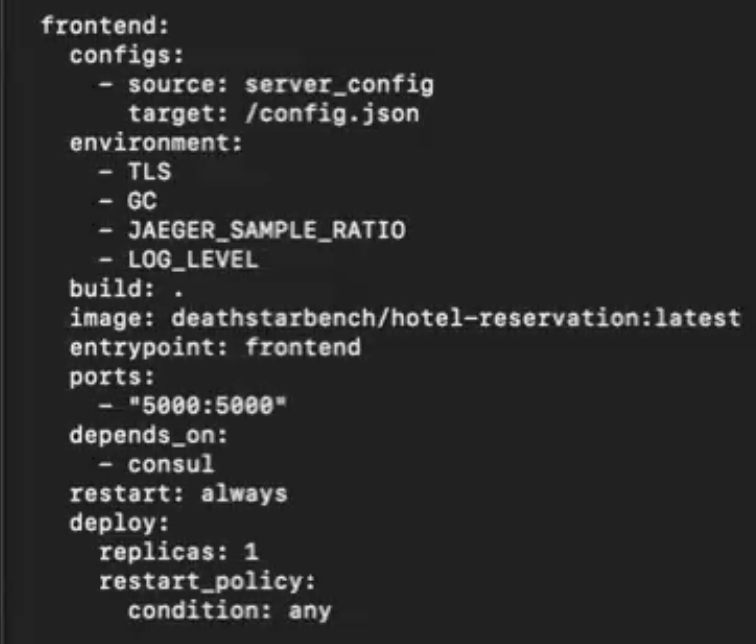

# Instructions for playing with Kubernetes in CloudLab using HotelReservation

This tutorial familiarizes participants with basic Kubernetes Operations, such as setting resource allocations for containers and scaling up/down a pod.  

## Start  the cluster 

1. Choose the deathstarbench-k8s-setup profile, which is part of the Tracing-Pythia project.
2. Enter the profile configuration options
     1. DeathStarBench in this profile is pre-built to work with Intel Machines, so choose machines w/Intel CPUs.  Good choices include c6525-25g and c6525-100g in CloudLab Utah.  
     2. You may or may not wish to increase the number of nodes.
     3. You can leave the rest of the options as default.
     4.  Read the README for deathstarbench-k8s-setup profile, which provides detailed information about the profile and how deathstarbench is configured.
     5. You will receive two emails, one indicating the clsuter is setting up and another indicating the cluster is ready.  Wait for the latter email before trying to use the cluster.  It can take up to 15 min. 
     6.  Once you receive the email, HotelReservation should be running within Kubernetes 

## Default configuration
1. (This should be in deathstarbench-k8s-setup-profile)

## Explore Kubernetes Commands

`kubectl` is the command for interfacing with and managing kubernetes clusters.  This [website](https://spacelift.io/blog/kubernetes-cheat-sheet) and this [one] (https://kubernetes.io/docs/concepts/workloads/controllers/deployment/)  provide a nice overview of this command.  Please read through them.  

#### Deployments
Deployments allows users to configure Kubrnetes Pods and Replicas.  
1. **List deployments**: `kubectl get deployments` lists all deployed services
   *`kubectl get deployments` lists all services deployed for HotelReservation. Such services' `NAMESPACE` is `default`.
   *`kubectl get deployments -A` lists all services deployed for HotelReservation as well as kubernetes services. The additional system services' `NAMESPACE` is `kube-system`.


2. **Get deployment info**: `kubectl describe deployments/<name>` describes details of deployments
   * 'kubectl get deployment/frontend` shows resource allocation and status informaton for the Frontend.
```
      Name:                   frontend
Namespace:              default
CreationTimestamp:      Tue, 06 Aug 2024 12:47:24 -0600
Labels:                 io.kompose.service=frontend
Annotations:            deployment.kubernetes.io/revision: 1
                        kompose.cmd: kompose convert
                        kompose.version: 1.22.0 (955b78124)
Selector:               io.kompose.service=frontend
Replicas:               1 desired | 1 updated | 1 total | 1 available | 0 unavailable
StrategyType:           RollingUpdate
MinReadySeconds:        0
RollingUpdateStrategy:  25% max unavailable, 25% max surge
Pod Template:
  Labels:       io.kompose.service=frontend
  Annotations:  kompose.cmd: kompose convert
                kompose.version: 1.22.0 (955b78124)
                sidecar.istio.io/statsInclusionPrefixes:
                  cluster.outbound,cluster_manager,listener_manager,http_mixer_filter,tcp_mixer_filter,server,cluster.xds-grp,listener,connection_manager
                sidecar.istio.io/statsInclusionRegexps: http.*
  Containers:
   hotel-reserv-frontend:
    Image:      deathstarbench/hotel-reservation:latest
    Port:       5000/TCP
    Host Port:  0/TCP
    Command:
      frontend
    Limits:
      cpu:  1
    Requests:
      cpu:        100m
    Environment:  <none>
    Mounts:       <none>
  Volumes:        <none>
Conditions:
  Type           Status  Reason
  ----           ------  ------
  Available      True    MinimumReplicasAvailable
  Progressing    True    NewReplicaSetAvailable
OldReplicaSets:  <none>
NewReplicaSet:   frontend-bd4f9cf9f (1/1 replicas created)
Events:          <none>
rajas@node-0:~$
```

3. **Get each service's deployment info**: `more <service_name>-deployment.yaml` describes details of deployment of one service. The unit of CPU under `resources` is `milicore`. 1000 `milicore` = 1 CPU core. `requests` specifies the amount of CPU guaranteed for this service and `limits` specifies the maximum allowed to allocate. 


4. **Change configuration**: In general, use `kubectl apply -h` to see a list of flags for different options for configuration update. One example is to copy one service's deployment yaml file, `recommendation-deployment.yaml`, to home directory and modify it. For example, change `replicas` and `requests`. To apply the new deployment policy, use `kubectl apply -f recommendation-deployment.yaml`. To check if the new service configuration is succesfully rolled out, use `kubectl rollout status deployments/recommendation`. Next, to get the details of deployments, use `kubectl describe deployments/recommendation`. The `Events` part should reflect the configuration policy changes.  


5. **Scale one service**: To scale a specific  service, use `kubectl scale deployments/<name> --replicas=<number>`. One example is `kubectl scale deployments/frontend --replicas=2`. Then, use `kubectl describe deployments/<name>` to check if the deployment details, indicated in the `Events`, reflect the scaling policy change. 


6. **Other YAML files for a service** `recommendation_service.yaml` specifies a service's label and ports to expose it to other services within the cluster. `recommendation_pvc.yaml` defines a Persistent Volume Claim (PVC) to request storage for the `recommendation` service. `recommendation_persistent-volume.yaml` specifies a Persistent Volume that provides the actual storage resource to which the PVC will bind.


7. **Port numbers** `docker-compose.yaml` specifies different services being laughted. It also specifies the mapping from external port numbers that is exposed publicly and internal port numbers that are inside a docker container. The external port numbers need to be unique.



8. **Differece between service.yaml and deployment.yaml** `recommendation-service.yaml` defines network access and loadBlancing strategies for a service, specifies stable IP address, port numbers, and a well-known DNS name to route traffic to corresponding pods.`recommendation-service.yaml` conceptually defines that a group of pods belong to one service and the pods are managed by policy specified by the `loadBalancer` field. When the field is left blank, it means the policy is left to the cloud provider to define it. `recommendation-deployment.yaml`, on the other hand, specifies deployment details including the number of replicas, images and resource limits. 

